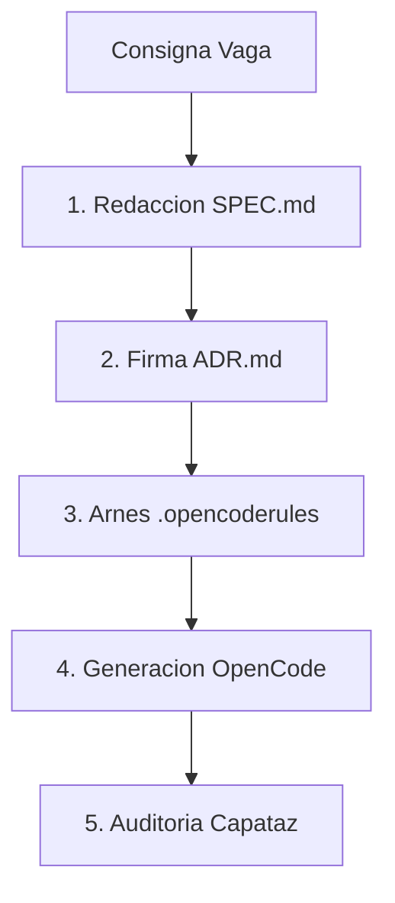

# Unidad 1: Procesos y Metodolog├¡as ÔÇö Del Vibe Coding al Spec-Driven Development (SDD)

## 1. Introducci├│n
En la era de la inteligencia artificial generativa, el mayor peligro en el desarrollo de software no es escribir c├│digo lento, sino construir sistemas enteros sin criterio t├®cnico. Esta unidad aborda la transici├│n cr├¡tica desde la generaci├│n impulsiva e intempestiva (Vibe Coding) hacia el Desarrollo Dirigido por Especificaciones (Spec-Driven Development), donde el desarrollador asume la soberan├¡a y la responsabilidad de la arquitectura.

---

## 2. Conceptos Clave
* **Programación por Vibras (Vibe Coding):** Práctica de redactar requerimientos vagos en lenguaje natural, aceptar el código generado por la IA sin auditoría y re-generar en bucle cuando ocurren errores.
* **Desarrollo Dirigido por Especificaciones (Spec-Driven Development / SDD):** Enfoque estructurado donde primero se especifican las reglas y modelos de dominio en texto plano declarativo (`SPEC.md`) y registros de decisi├│n (`ADR.md`), y luego se utiliza la IA para implementar bajo esas restricciones inmutables.
* **Gobernanza del Contexto y Arneses (Harnessing):** T├®cnica de confinamiento de modelos de IA mediante archivos de reglas locales (`.opencoderules` e `INSTRUCTIONS.md`) que imponen patrones de dise├▒o, tipado estricto e inmutabilidad de contexto.
* **Motor OpenCode (OpenCode Rules):** Herramienta de ejecución local determinista que lee payloads estructurados (`.json`) y arneses de proyecto para aplicar cambios automáticos y mantener memoria persistente (`.gbrain`).

---

## 3. Analogía Pedagógica Cotidiana
* **El Vibe Coding es pedirle a un mozo en un restaurante:** *"Traeme algo rico"*. El resultado es azaroso, probablemente costoso y no satisface las necesidades reales.
* **El Spec-Driven Development (SDD) es el Arquitecto de Obra:** El estudiante no es el obrero que coloca ladrillos a ciegas; es el **Arquitecto** que dise├▒a los planos detallados, especifica los materiales inmutables, dirige la construcci├│n ejecutada por la constructora (la IA) y firma la responsabilidad t├®cnica final.
* **El Arn├®s (`.opencoderules`) son los barandales de un puente:** Imposibilitan f├¡sica y l├│gicamente que la IA caiga al vac├¡o o genere estructuras fuera del ├írea segura autorizada.

---

## 4. Ejemplo Práctico
Supongamos la creaci├│n de una pantalla de autenticaci├│n.
* **Enfoque Vibe Coding (Incorrecto):** Copiar al chat *"Hac├® un login copado con NodeJS"*. La IA decidir├í la base de datos, el algoritmo de hash y el manejo de sesiones de forma arbitraria, generando deuda t├®cnica invisible.
* **Enfoque SDD (Correcto):**
  1. Redactar `SPEC.md` definiendo variables de entrada, contrato de salida JSON, c├│digos HTTP y *Non-Goals* (Ej: *"No implementar OAuth2 en esta versi├│n"*).
  2. Documentar en `ADR-001.md` la elecci├│n de JWT firmado con Ed25519.
  3. Ejecutar OpenCode bajo las reglas del arn├®s `.opencoderules`.

---

**Diagrama ilustrativo — Ciclo de vida SDD:**

---

## 5. Comparativas: Vibe Coding vs. Spec-Driven Development

| Eje | Programaci├│n por Vibras (Vibe Coding) | Desarrollo Dirigido por Especificaciones (SDD) |
| :--- | :--- | :--- |
| **Flujo de Trabajo** | Impulsivo / Prueba y error a ciegas. | 4 Pasos: Especificar (`SPEC.md`), Dise├▒ar (`ADR.md`), Dirigir, Auditar. |
| **Uso de Tokens** | Re-generaci├│n masiva e ineficiente ("Factura Econ├│mica"). | Prompts deterministas acotados y gobernados por el arn├®s. |
| **Soberanía** | Delegación ciega del diseño en la IA ("Atrofia Cognitiva"). | El estudiante es el Arquitecto que firma la responsabilidad. |
| **Documentaci├│n** | Inexistente o generada a posteriori. | Parte fundamental con **arc42** (Secci├│n B1), **C4 Model** (B2) y **ADRs** (B3/B4). |

---

## 6. Fuentes y Marcos de Referencia (Tabla Unificada de Recursos)
El estudiante debe consultar los siguientes marcos y bibliografía obligatoria para esta unidad:
* **[B1] arc42 Framework:** Template de 12 secciones para documentar arquitectura. [arc42.org](https://arc42.org/)
* **[B2] C4 Model (Simon Brown):** Visualizaci├│n en 4 niveles (Contexto, Contenedores, Componentes, C├│digo). [c4model.com](https://c4model.com/)
* **[B3/B4] ADR / MADR Template:** Registros ligeros de decisiones de arquitectura. [adr.github.io/madr](https://adr.github.io/madr/)
* **[B5] PlantUML / Mermaid:** Generaci├│n de diagramas como c├│digo versionables en Git. [mermaid.js.org](https://mermaid.js.org/)
* **[C1] Beyond Vibe Coding (Addy Osmani):** Marco de trabajo *"Plan first, code second"*. [beyond.addy.ie](https://beyond.addy.ie/)
* **[Gobernanza IES 9-018]:** Marco de gobernanza de servicios digitales del instituto. [IES9018/gobernanza-servicios-digitales](https://github.com/IES9018/gobernanza-servicios-digitales)

---

## 7. Para Practicar
1. **Ejercicio 1:** Transformar una consigna vaga (*"Un sistema de turnos para el hospital"*) en una especificación declarativa `SPEC.md` delimitando explícitamente los *Non-Goals*.
2. **Ejercicio 2:** Configurar un archivo de arn├®s `.opencoderules` restringiendo la IA para que utilice ├║nicamente sintaxis ECMAScript 2024 y proscriba el tipo `any`.
3. **Ejercicio 3:** Documentar una decisi├│n de base de datos SQL vs NoSQL utilizando la plantilla MADR (`ADR-001.md`).
