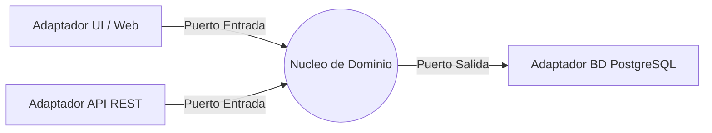

# Unidad 2: Arquitectura de Software ÔÇö Estilos, Decisiones y Modelos de Documentaci├│n

---

## 1. Introducci├│n
Arquitectar no es dibujar cajas y flechas: es tomar decisiones estructurales caras de revertir y dejarlas registradas para que el equipo entero entienda por qu├® el sistema es como es. Esta unidad introduce los estilos arquitect├│nicos m├ís influyentes (capas, tuber├¡as/filtros, MVC, hexagonal), el lenguaje visual del Modelo C4 para comunicarlos, y la pr├íctica de ADRs para que ninguna decisi├│n quede en la cabeza de una sola persona.

---

## 2. Conceptos Clave
* **Estilo Arquitectónico:** Familia de decisiones repetibles sobre cómo se organizan los componentes (capas, eventos, microservicios, tuberías).
* **Arquitectura en Capas:** Separaci├│n en niveles con responsabilidades exclusivas (presentaci├│n, aplicaci├│n/l├│gica, persistencia) donde cada capa solo depende de la inferior.
* **Tuberías y Filtros (Pipes & Filters):** Cada componente transforma una entrada en una salida y se encadenan como una línea de producción (compiladores, ETL, streams).
* **MVC (Model-View-Controller):** Separa datos (Modelo), interfaz (Vista) y l├│gica de entrada (Controlador) para que cambios de pantalla no rompan reglas de negocio.
* **Arquitectura Hexagonal (Ports & Adapters):** El dominio vive al centro; el mundo exterior (BD, HTTP, UI) se conecta mediante puertos (interfaces) y adaptadores intercambiables.
* **Modelo C4 (Simon Brown):** Diagramas en 4 niveles de zoom ÔÇö Contexto, Contenedores, Componentes y C├│digo ÔÇö para contar la misma historia a p├║blicos distintos.
* **ADR (Architectural Decision Record):** Documento corto e inmutable que registra una decisi├│n, su contexto y sus consecuencias (plantilla MADR).

---

## 3. Analogía Pedagógica Cotidiana
* **La arquitectura es el plano el├®ctrico y estructural de un edificio:** define d├│nde pasan los ca├▒os, qu├® paredes cargan peso y por qu├®. Colocar tabiques "sobre la marcha" (Vibe Coding estructural) funciona hasta que hay que instalar el gas y hay que tirar todo abajo.
* **El ADR es el libro de obra:** cada d├¡a el maestro mayor anota qu├® decidi├│, por qu├® y qu├® alternativas descart├│; si dentro de un a├▒o alguien pregunta "┬┐por qu├® esta viga?", hay respuesta escrita.

---

## 4. Ejemplo Práctico
**Situaci├│n inicial:** un monolito donde las rutas HTTP escriben SQL directo y las reglas de negocio viven mezcladas en los controladores.
**Transformaci├│n hacia Hexagonal:**
1. Extraer las reglas de negocio a un núcleo `domain/` que no importa ninguna librería externa.
2. Definir puertos: `RepositorioTurnos` (interfaz) que el dominio necesita, sin saber si atrás está PostgreSQL o un archivo.
3. Implementar adaptadores: `AdaptadorPostgres`, `AdaptadorHTTP` que traducen el mundo exterior a los puertos.
4. Resultado: cambiar la base de datos o exponer una API nueva toca solo adaptadores; el dominio queda intacto y testeable sin red.

---

**Diagrama ilustrativo — Arquitectura Hexagonal (puertos y adaptadores):**



---

## 5. Tabla Comparativa: Monolito Modular vs. Hexagonal vs. Microservicios

| Eje | Monolito Modular | Hexagonal (Monolito Desacoplado) | Microservicios |
| :--- | :--- | :--- | :--- |
| **Despliegue** | Una sola unidad | Una sola unidad | Muchas unidades independientes |
| **Acoplamiento** | Bajo si hay módulos claros | Mínimo hacia afuera vía puertos | Red (contratos de red) |
| **Escalabilidad** | Del conjunto | Del conjunto | Por servicio individual |
| **Complejidad operativa** | Baja | Media | Alta (orquestaci├│n, observabilidad) |
| **Equipo ideal** | 1ÔÇô5 devs | 2ÔÇô10 devs | Equipos independientes por servicio |
| **Cuándo elegirlo** | MVPs, equipos chicos | Cuando el dominio vale más que la escala | Escala masiva u organización por dominios |

---

## 6. Fuentes y Marcos de Referencia (Tabla Unificada)
* **[arc42]** Plantilla de documentaci├│n arquitect├│nica en 12 secciones: [arc42.org](https://arc42.org/)
* **[C4 Model]** Simon Brown ÔÇö visualizaci├│n Contexto/Contenedores/Componentes/C├│digo: [c4model.com](https://c4model.com/)
* **[PoEAA]** Martin Fowler ÔÇö *Patterns of Enterprise Application Architecture* (capas, Repository, MVC): [martinfowler.com/books.html#eaa](https://martinfowler.com/books.html#eaa)
* **[MADR]** Plantilla ligera para ADRs: [adr.github.io/madr](https://adr.github.io/madr/)
* **[Hexagonal]** Alistair Cockburn ÔÇö art├¡culo original de Ports & Adapters: [alistair.cockburn.us](https://alistair.cockburn.us/hexagonal-architecture/)

---

## 7. Para Practicar (con Rúbrica de Auditoría)
1. **Ejercicio 1 ÔÇö Diagrama C4 Nivel 2:** Elabor├í en Mermaid el diagrama de Contenedores de tu proyecto integrador (cliente, API, base de datos, servicios externos). *Se eval├║a:* contenedores correctos, protocolos anotados (`HTTPS/JSON`, `TCP`), y que el diagrama est├® versionado en Git.
   ```mermaid
   C4Container
     title Sistema de Turnos - Contenedores
     Person(paciente, "Paciente")
     Container(spa, "SPA Web", "React", "Interfaz de turnos")
     Container(api, "API Turnos", "FastAPI", "Reglas de negocio")
     ContainerDb(db, "PostgreSQL", "Datos operativos")
     Rel(paciente, spa, "Usa")
     Rel(spa, api, "Consume", "HTTPS/JSON")
     Rel(api, db, "Lee/Escribe", "TCP")
   ```
2. **Ejercicio 2 ÔÇö ADR-002:** Redact├í `docs/adr/ADR-002-seleccion-de-framework.md` con plantilla MADR justificando la elecci├│n del framework backend de tu proyecto (inclu├¡ al menos dos alternativas descartadas con criterios objetivos).
