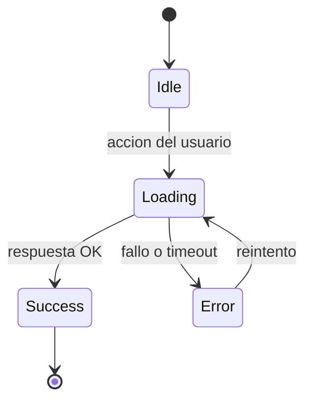

# Unidad 3: Diseño de Interfaces — HCI, Usabilidad y Sistemas de Diseño

---

## 1. Introducción
Una interfaz no se diseña para quedar bonita en el portfolio: se diseña para que una persona concreta logre su objetivo con la menor fricción posible. La Interacción Humano-Computadora (HCI) aporta décadas de evidencia sobre cómo percibimos, decidimos y nos equivocamos frente a una pantalla. Esta unidad traduce esa evidencia en decisiones verificables: wireframes que prueban estructura, prototipos que prueban flujo, y sistemas de diseño que evitan reinventar un botón en cada pantalla.

---

## 2. Conceptos Clave
* **HCI (Human-Computer Interaction):** Disciplina que estudia cómo las personas usan sistemas computacionales y cómo diseñar para minimizar error y esfuerzo.
* **Usabilidad:** Eficacia, eficiencia y satisfacción con las que un usuario logra sus objetivos (ISO 9241). Medible, no decorativa.
* **Ergonomía de Software:** Adaptar la interfaz a las capacidades humanas: memoria de trabajo limitada, objetivos de toque (44px), jerarquía visual.
* **UX vs UI:** UX es la experiencia completa del recorrido (antes, durante y después del uso); UI es la capa visible e interactiva. Una UI linda puede sostener una UX pésima.
* **Wireframe:** Boceto de baja fidelidad que define estructura y jerarquía sin diseño visual.
* **Mockup:** Representación estática de alta fidelidad: colores, tipografía, componentes finales.
* **Prototipo:** Versión navegable que simula el flujo real para testear antes de programar.
* **Responsive Design:** Una misma interfaz que se adapta a viewport distintos mediante grillas flexibles, media queries e imágenes fluidas.
* **Sistema de Diseño:** Biblioteca de tokens (colores, espaciados, tipografía) + componentes reutilizables + reglas de uso.

---

## 3. Analogía Pedagógica Cotidiana
* **La interfaz es el tablero de mandos de un automóvil:** los pedales van siempre a la izquierda/derecha, el volante al centro, la bocina al alcance del pulgar. Nadie "rediseña" esa posición en cada auto porque millones de conductores ya la aprendieron: la ergonomía prevalece sobre la creatividad del diseñador.
* **Un wireframe es el croquis con palitos de la distribución del muebles; el mockup, la foto renderizada del ambiente; y el prototipo, recorrer la casa modelada en 3D antes de construirla.**

---

## 4. Ejemplo Práctico
**Consigna:** checkout mobile accesible para una tienda online.
1. **Wireframe:** pantalla única con resumen de carrito arriba, formulario reducido a 3 campos visibles, botón fijo de confirmación abajo (thumb zone).
2. **Accesibilidad desde el diseño:** contraste mínimo 4.5:1 (WCAG 2.2 AA) entre texto y fondo; área táctil ≥ 44×44px; etiquetas siempre visibles, nunca solo placeholders.
3. **Estados obligatorios:** vacío, cargando (skeleton/spinner + botón deshabilitado), error de pago con mensaje accionable ("Revisá los datos de la tarjeta"), éxito con confirmación clara.
4. **Prueba:** prototipo navegable testeado con 5 usuarios; si más de uno duda dónde pagar, se rediseña antes de escribir código.

---

**Diagrama ilustrativo — Estados obligatorios de un componente UI:**

---

## 5. Tabla Comparativa: Wireframe vs. Mockup vs. Prototipo

| Eje | Wireframe (Baja Fidelidad) | Mockup (Media/Alta Estática) | Prototipo (Alta Fidelidad Interactiva) |
| :--- | :--- | :--- | :--- |
| **Qué define** | Estructura y jerarquía | Aspecto visual final | Flujo y comportamiento |
| **Tiempo de producción** | Minutos | Horas | Horas–días |
| **Herramientas típicas** | Papel, Excalidraw, Balsamiq | Figma (diseño) | Figma (prototyping), Storybook |
| **Feedback que obtiene** | "¿Está todo lo necesario?" | "¿Se ve y se lee bien?" | "¿El recorrido funciona?" |
| **Cuándo usarlo** | Siempre, primero | Tras validar estructura | Antes de estimar/programar |

---

## 6. Fuentes y Marcos de Referencia (Tabla Unificada)
* **[Nielsen Norman Group]** Las 10 heurísticas de usabilidad de Jakob Nielsen: [nngroup.com/articles/ten-usability-heuristics](https://www.nngroup.com/articles/ten-usability-heuristics/)
* **[WCAG 2.2]** Estándar W3C de accesibilidad de contenido web: [w3.org/TR/WCAG22](https://www.w3.org/TR/WCAG22/)
* **[Refactoring UI]** Wathan & Schoger — decisiones visuales prácticas para desarrolladores: [refactoringui.com](https://www.refactoringui.com/)
* **[Material Design 3 / Apple HIG]** Sistemas de diseño de referencia de las dos plataformas dominantes: [m3.material.io](https://m3.material.io/) · [developer.apple.com/design](https://developer.apple.com/design/human-interface-guidelines/)

---

## 7. Para Practicar (con Rúbrica de Auditoría)
1. **Ejercicio 1 — Auditoría heurística:** Elegí una app real de uso masivo (banco, delivery, turnos) y evaluá 5 pantallas contra las 10 heurísticas de Nielsen. Entregable: tabla hallazgo → heurística violada → severidad → propuesta de corrección.
2. **Ejercicio 2 — UI Tokens en SPEC.md:** Especificá en tu `SPEC.md` los tokens del sistema de diseño de tu proyecto: paleta con contraste validado WCAG AA, escala tipográfica, espaciados (múltiplos de 4/8px), radios y estados de cada componente interactivo (default/hover/focus/disabled/error).
