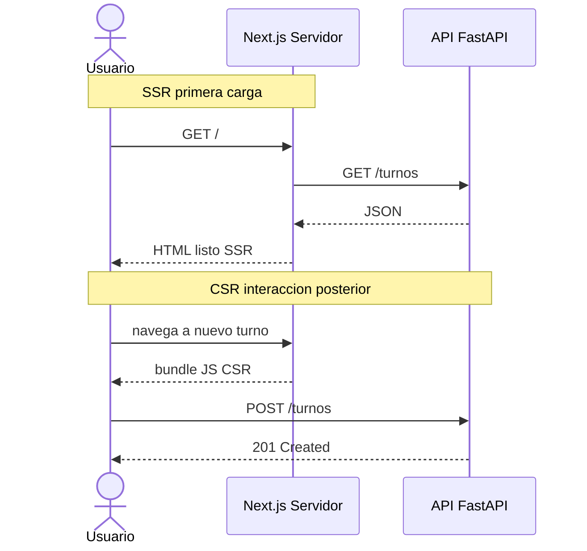

# Unidad 4: Arquitectura Web — Renderizado Distribuido, APIs y Datos

---

## 1. Introducción
La web moderna es un sistema distribuido donde la pregunta "¿dónde se arma la pantalla?" define rendimiento, SEO, costos de infraestructura y experiencia. Esta unidad recorre el modelo cliente-servidor, las estrategias de renderizado (CSR/SSR/SSG/ISR), el diseño de APIs REST documentadas como contrato, y el stack de referencia React/Next.js + FastAPI/NestJS sobre PostgreSQL.

---

## 2. Conceptos Clave
* **Modelo Cliente-Servidor:** El cliente (navegador) solicita; el servidor procesa y resuelve recursos bajo el protocolo HTTP sin estado.
* **CSR (Client-Side Rendering):** El navegador descarga un esqueleto JS y arma la interfaz en el dispositivo del usuario.
* **SSR (Server-Side Rendering):** El servidor genera el HTML completo de cada petición y lo envía listo para pintar.
* **SSG / ISR:** Generación estática anticipada (build) o re-validada periódicamente: velocidad de estático con frescura controlada.
* **React / Next.js:** Biblioteca de UI por componentes y framework con híbridos de renderizado, rutas y optimizaciones integradas.
* **REST y GraphQL:** Estilos de exposición de datos: recursos + verbos HTTP con contratos OpenAPI, o consulta declarativa con esquema tipado.
* **FastAPI / NestJS:** Frameworks backend (Python/TypeScript) con validación, inyección de dependencias y documentación automática.
* **PostgreSQL:** Base relacional transaccional, estándar de facto para dominios con integridad fuerte.

---

## 3. Analogía Pedagógica Cotidiana
* **El restaurante explica los tres renderizados:** CSR es comprar comida congelada y hornearla en tu casa: viaja liviana pero tu horno trabaja al final. SSR es comer en el salón: el chef arma el plato completo y te lo sirve listo, aunque cada pedido carga al personal del local. SSG es el buffet preparado a media mañana: sale instantáneo, pero lo que no se agotó se regenera cada tanto.
* **Una API REST bien diseñada es la carta del restaurante con precios y descripciones exactas:** sabés qué podés pedir, cómo y qué vas a recibir antes de hacerlo.

---

## 4. Ejemplo Práctico
**Consigna:** API de turnos médicos consumida por un frontend Next.js.
1. **Contrato primero (`SPEC.md`):** recursos `/turnos`, `/turnos/{id}`, verbos, códigos HTTP (`201` creación, `409` turno ocupado), paginación `?page=&size=`, y errores con cuerpo uniforme `{"code", "message", "details"}`.
2. **Implementación FastAPI:** routers por recurso, Pydantic para validación de entrada/salida, y documentación OpenAPI/Swagger autogenerada en `/docs` que funciona como contrato verificable.
3. **Consumo Next.js:** server components para listados (SSR + caché), client components solo donde hay interacción; manejo de estados de carga y error según Unidad 3.
4. **Persistencia PostgreSQL:** tablas normalizadas, constraint de unicidad `(medico_id, fecha_hora)` para que la "doble reserva" sea imposible a nivel base y no solo a nivel código.

---

**Diagrama ilustrativo — SSR/CSR y contrato de API:**



---

## 5. Tabla Comparativa: CSR vs SSR vs SSG

| Eje | CSR | SSR | SSG |
| :--- | :--- | :--- | :--- |
| **¿Dónde se arma la página?** | Navegador del usuario | Servidor en cada request | Servidor en tiempo de build |
| **TTFB / primer render** | Lento inicial | Rápido | Instantáneo |
| **SEO** | Requiere hidratación cuidadosa | Excelente | Excelente |
| **Carga del servidor** | Baja | Alta (por request) | Casi nula |
| **Datos en vivo** | Ideal (llama APIs desde el cliente) | Frecuentes y personalizadas | Contenido que cambia poco (+ISR) |
| **Casos típicos** | Dashboards tras login | E-commerce, portales públicos | Landing, docs, blogs |

---

## 6. Fuentes y Marcos de Referencia (Tabla Unificada)
* **[MDN Web Docs]** Referencia canónica de HTTP, CORS, fetch y rendering web: [developer.mozilla.org](https://developer.mozilla.org/)
* **[Next.js Documentation]** Estrategias de renderizado y arquitectura de aplicación: [nextjs.org/docs](https://nextjs.org/docs)
* **[REST API Design Rulebook]** Mark Masse — convenciones de recursos, verbos y códigos HTTP: O'Reilly Media.
* **[FastAPI]** Guía oficial con validación Pydantic y OpenAPI integrado: [fastapi.tiangolo.com](https://fastapi.tiangolo.com/)
* **[OpenAPI Specification]** Contrato legible por máquinas para APIs: [spec.openapis.org](https://spec.openapis.org/)

---

## 7. Para Practicar (con Rúbrica de Auditoría)
1. **Ejercicio 1 — Contrato API en SPEC.md:** Definí en tu `SPEC.md` el contrato JSON completo de un recurso de tu proyecto: campos con tipos, validaciones, códigos HTTP de éxito/error y ejemplos de request/response. *Se evalúa:* completitud de códigos de error y presencia de Non-Goals ("esta versión no pagina más allá de 100 registros").
2. **Ejercicio 2 — Diagrama de secuencia:** Modelá en Mermaid el flujo cliente → API → base de datos de una operación crítica tuya, incluyendo el caso de error.
   ```mermaid
   sequenceDiagram
     participant C as Cliente (Next.js)
     participant A as API (FastAPI)
     participant D as PostgreSQL
     C->>A: POST /turnos {paciente, medico, fecha}
     A->>D: INSERT (constraint unicidad)
     alt hueco disponible
       D-->>A: OK
       A-->>C: 201 Created
     else turno ocupado
       D-->>A: violation unique
       A-->>C: 409 Conflict {code:"TURNO_OCUPADO"}
     end
   ```
