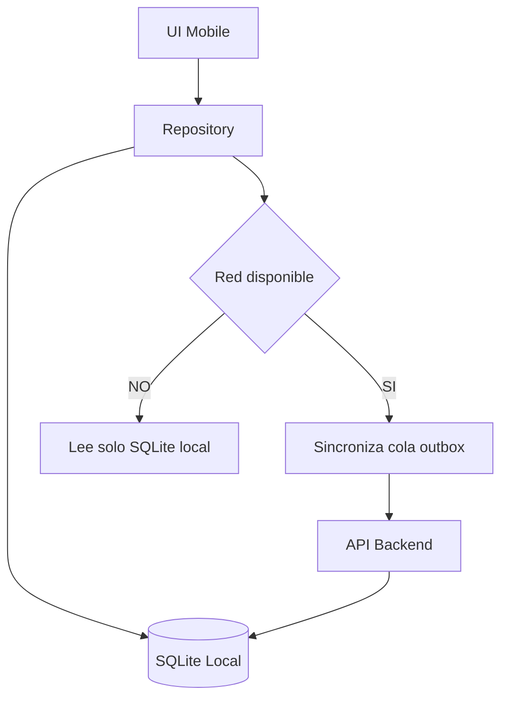

# Unidad 5: Arquitectura Mobile ÔÇö Plataformas, Offline-First y Sincronizaci├│n

---

## 1. Introducci├│n
Mobile no es "la web achicada": es un entorno con batería finita, red intermitente, almacenamiento acotado y un sistema operativo que mata procesos cuando quiere. Arquitectar para mobile es diseñar explícitamente para la desconexión, el ciclo de vida agresivo de las apps y la diversidad de plataformas. Esta unidad compara estrategias (nativo, híbrido, cross-platform, PWA) y profundiza en el patrón que separa las apps serias de los prototipos: Offline-First con sincronización controlada.

---

## 2. Conceptos Clave
* **App Nativa:** Desarrollada con el stack propio de la plataforma (Kotlin/Android, Swift/iOS): máxima performance y acceso completo a APIs del dispositivo.
* **App Híbrida:** WebView que muestra HTML/CSS/JS empaquetado (Cordova/Capacitor): un código, experiencia limitada.
* **Cross-Platform:** Un lenguaje de alto nivel compilado o puenteado a ambas plataformas (Flutter, React Native).
* **PWA (Progressive Web App):** Web instalable con service workers; alcance universal, acceso parcial al hardware.
* **Offline-First:** La app funciona plenamente sin red contra una base local y sincroniza al reconectar; la red pasa a ser una optimizaci├│n, no un requisito.
* **Patr├│n Repository:** Capa ├║nica de acceso a datos que abstrae al resto de la app sobre el origen (remoto hoy, local ma├▒ana, cach├® siempre).
* **Push Notifications:** Canal del sistema operativo para re-engagement; requiere backend de notificaciones y manejo de permisos.
* **Ciclo de Vida Agresivo:** El SO finaliza procesos en background; todo estado crítico debe persistirse localmente.

---

## 3. Analogía Pedagógica Cotidiana
* **Offline-First es el buzón de correo postal:** escribís cartas en el tren sin señal, las guardás en el bolsillo y cuando pasás por el buzón las despachás todas juntas. El destinatario nunca nota que viajaste offline: recibe las cartas ordenadas y sin duplicados.
* **Nativo vs cross-platform es construir con materiales locales y mano de obra especializada vs. una constructora única con planos adaptados a cada ciudad:** más rápido y barato, siempre que no necesites algo muy específico del terreno.

---

## 4. Ejemplo Práctico
**Consigna:** app de inspecciones rurales que funciona sin cobertura.
1. **Base local SQLite como fuente primaria:** toda lectura/escritura de la UI golpea el repositorio local; jamás directamente la red.
2. **Patr├│n Repository:** `InspeccionRepository` expone `obtener()`, `guardar()`, `pendientesDeSync()`; la UI ignora si hay internet.
3. **Cola de salida (outbox):** cada cambio se marca `pending_sync`; un WorkManager/BGTask sincroniza en segundo plano con backoff exponencial.
4. **Sincronizaci├│n bidireccional:** el servidor devuelve `updated_at` por registro; conflicto resuelto por regla declarada en la SPEC (ej.: last-write-wins para campos t├®cnicos, merge manual para observaciones del auditor).
5. **UX honesta:** badge "N cambios pendientes" + bot├│n manual de sincronizar; nunca perder datos del usuario por un error de red.

---

**Diagrama ilustrativo — Patron Repository Offline-First:**

---

## 5. Tabla Comparativa: Nativo vs Cross-Platform vs PWA

| Eje | Nativo (Kotlin/Swift) | Cross-Platform (Flutter/RN) | PWA |
| :--- | :--- | :--- | :--- |
| **Performance UI** | Máxima (60/120fps garantizados) | Muy buena (casi indistinguible) | Limitada por navegador |
| **Acceso a hardware** | Completo e inmediato | Amplio vía plugins | Parcial (sensores básicos) |
| **Costo / equipo** | Dos codebases, dos equipos | Una codebase | Web team existente |
| **Time-to-market** | Lento | Medio | Rápido |
| **Distribuci├│n** | Stores (revisi├│n incluida) | Stores | URL directa (sin store) |
| **Cuándo elegirlo** | Juegos, AR, performance crítica | Producto multiplataforma estándar | Alcance masivo sin instalación |

---

## 6. Fuentes y Marcos de Referencia (Tabla Unificada)
* **[Android Developers]** *Guide to App Architecture* (ViewModel, Repository, Flow): [developer.android.com/topic/architecture](https://developer.android.com/topic/architecture)
* **[Apple HIG]** Human Interface Guidelines ÔÇö patrones y ergonom├¡a iOS: [developer.apple.com/design](https://developer.apple.com/design/human-interface-guidelines/)
* **[web.dev ÔÇö Offline/Workbox]** Fundamentos de service workers y estrategia offline: [web.dev/learn/pwa](https://web.dev/learn/pwa/)
* **[Flutter Docs]** Arquitectura recomendada por Google: [docs.flutter.dev](https://docs.flutter.dev/app-architecture)
* **[React Native Docs]** Guías oficiales de plataforma: [reactnative.dev](https://reactnative.dev/docs/getting-started)

---

## 7. Para Practicar (con Rúbrica de Auditoría)
1. **Ejercicio 1 ÔÇö Estrategia de sincronizaci├│n:** Document├í en tu proyecto la estrategia Offline-First completa: qu├® tabla es fuente primaria local, formato de la cola outbox, pol├¡tica de resoluci├│n de conflictos (justificada), y qu├® ve el usuario cuando hay pendientes. *Se eval├║a:* que ning├║n dato pueda perderse seg├║n el dise├▒o.
2. **Ejercicio 2 ÔÇö ADR de stack mobile:** Redact├í `ADR-mobile-stack.md` eligiendo entre nativo, Flutter/RN y PWA para tu proyecto integrador, con al menos dos alternativas descartadas y criterios objetivos (equipo, presupuesto, hardware requerido, plazo).
