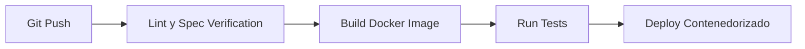

# Unidad 6: Herramientas, Tecnolog├¡as e Integraci├│n ÔÇö Docker, CI/CD y Automatizaci├│n con Arn├®s

---

## 1. Introducci├│n
Entregar software "a mano" es entregarlo con variabilidad: funciona en mi m├íquina, se rompe en producci├│n, y nadie sabe exactamente qu├® versi├│n qued├│ publicada. La integraci├│n continua convierte cada cambio en un proceso automatizado, reproducible y auditado por m├íquinas antes que por personas. Esta unidad cierra el ciclo de la c├ítedra: los arneses que gobiernan la IA (Unidad 1) ahora tambi├®n gobiernan la l├¡nea de montaje que valida y despliega lo generado.

---

## 2. Conceptos Clave
* **Contenedores Docker:** Empaquetado de aplicación + dependencias + runtime en una imagen inmutable; "en mi máquina" deja de ser excusa porque la máquina viaja dentro de la imagen.
* **CI (Integración Continua):** Cada push dispara validaciones automáticas: linters, tests, builds. Romper la rama principal se detecta en minutos, no en producción.
* **CD (Despliegue Continuo/Entrega):** Lo validado por CI llega a producci├│n (continuo) o a un estadio listo para publicar con un click (entrega).
* **GitHub Actions:** Sistema de pipelines nativo de GitHub: workflows en YAML versionados junto al c├│digo, jobs corriendo en runners.
* **Workflow / Job / Step:** Jerarquía del pipeline: un archivo `.yml` (workflow) contiene jobs que contienen steps ejecutables.
* **Automatizaci├│n con Arn├®s de Contexto:** Las mismas reglas que limitan al agente IA limitan el pipeline: nada entra a `main` sin SPEC asociada, checks verdes y revisi├│n.
* **Integración OpenCode:** Los payloads deterministas del core-cli pueden dispararse/validarse dentro del flujo CI, llevando auditoría y memoria (`.gbrain`) al pipeline.

---

## 3. Analogía Pedagógica Cotidiana
* **El pipeline CI/CD es la línea de montaje robotizada de una fábrica de autos:** cada estación (linter, tests, build) hace un chequeo automático; si una pieza sale defectuosa, la chapa no avanza a la siguiente estación. Nadie discute con el robot ni le pide "pasame igual, confía".
* **Docker es el container de carga mar├¡timo:** estandarizado mundialmente; da igual qu├® hay adentro (auto, heladera, tu app), cualquier gr├║a de cualquier puerto puede moverlo.

---

## 4. Ejemplo Práctico
**Consigna:** pipeline que audita SPECs, lintea y compila en cada Pull Request.
1. **Validación de especificaciones:** verificar que cada PR que toca código traiga su `SPEC.md` o modifique uno existente (gobernanza SDD aplicada por máquina).
2. **Linter:** ejecutar el linter del lenguaje (`ruff` para Python, `eslint` para TS) fallando el job ante advertencias graves.
3. **Build Docker:** construir la imagen desde el `Dockerfile` para probar que compila y empaqueta; opcionalmente correr tests dentro del contenedor.
```yaml
name: verify-spec
on:
  pull_request:
    branches: [main, develop]
jobs:
  auditoria:
    runs-on: ubuntu-latest
    steps:
      - uses: actions/checkout@v4
      - name: SPEC presente si cambia codigo
        run: |
          if git diff --name-only origin/main... | grep -Ev '\.md$' | grep -q .; then
            git diff --name-only origin/main... | grep -qi 'SPEC.md' || { echo "::error::Cambios de codigo sin SPEC.md"; exit 1; }
          fi
      - name: Lint markdown de especificaciones
        uses: DavidAnson/markdownlint-cli2-action@v17
        with: { globs: "**/*.md" }
```

---

**Diagrama ilustrativo — Pipeline CI/CD con GitHub Actions:**



---

## 5. Tabla Comparativa: Despliegue Manual (FTP) vs Pipeline CI/CD + Docker

| Eje | Despliegue Manual por FTP | Pipeline CI/CD + Docker |
| :--- | :--- | :--- |
| **Velocidad de entrega** | Horas/días, depende de una persona | Minutos, automático tras merge |
| **Trazabilidad** | Nula ("┬┐qui├®n subi├│ esto?") | Cada release ligada a commit, PR y logs |
| **Consistencia de entorno** | Difiere dev/prod garantizado | Misma imagen en todos los ambientes |
| **Rollback** | Manual, bajo presi├│n, con errores | Re-deploy del tag anterior en un paso |
| **Seguridad** | Credenciales en FTP plano, secretos dispersos | Secretos gestionados por plataforma, acceso mínimo |
| **Auditoría docente** | Imposible de verificar post-hoc | Checks visibles en cada Pull Request |

---

## 6. Fuentes y Marcos de Referencia (Tabla Unificada)
* **[Docker Docs]** Guías oficiales de imágenes, Dockerfile y compose: [docs.docker.com](https://docs.docker.com/)
* **[GitHub Actions ÔÇö Workflow Syntax]** Referencia can├│nica de triggers, jobs y steps: [docs.github.com/actions](https://docs.github.com/en/actions/using-workflows/workflow-syntax-for-github-actions)
* **[OpenCode Engine Specs]** Especificación del motor determinista y arneses usados en cátedra: [github.com/v8paulofelix/core-cli](https://github.com/v8paulofelix/core-cli)
* **[GitHub Flow]** Modelo simple de ramas recomendado como base del Git Flow de la materia: [docs.github.com/flow](https://docs.github.com/en/get-started/quickstart/github-flow)

---

## 7. Para Practicar (con Rúbrica de Auditoría)
1. **Ejercicio 1 ÔÇö `verify-spec.yml`:** Crear en tu repositorio individual `.github/workflows/verify-spec.yml` que audite los `.md` de especificaci├│n en cada Pull Request contra `develop`. *Se eval├║a:* trigger correcto, job que falla cuando falta la SPEC, y captura del log en el PR.
2. **Ejercicio 2 ÔÇö Contenedorizar tu proyecto:** Escribir un `Dockerfile` multi-stage (build + runtime liviano) para tu proyecto integrador y validar el build dentro de GitHub Actions. *Se eval├║a:* imagen < 500MB, sin secretos en capas, y build verde en CI.
